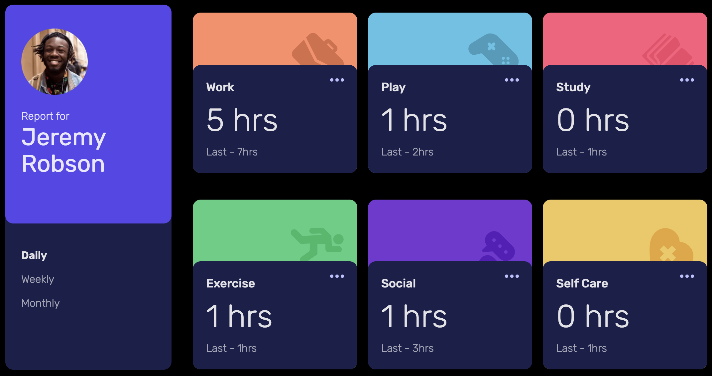
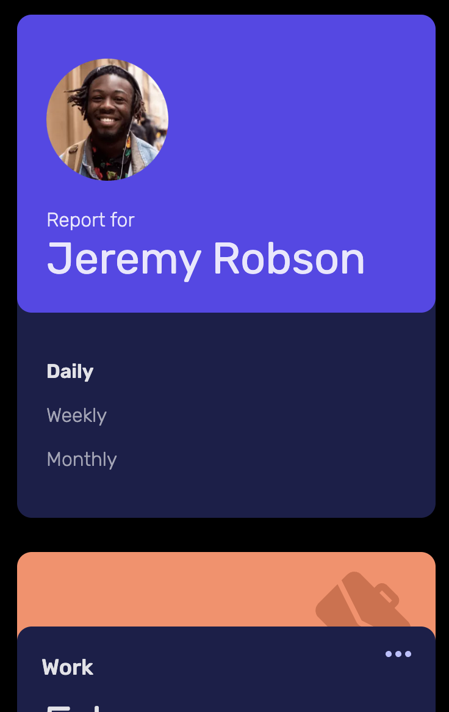
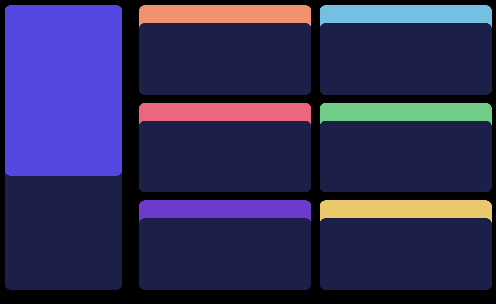

# Frontend Mentor - Time tracking dashboard solution

This is a solution to the [Time tracking dashboard challenge on Frontend Mentor](https://www.frontendmentor.io/challenges/time-tracking-dashboard-UIQ7167Jw). Frontend Mentor challenges help you improve your coding skills by building realistic projects.

## Table of contents

- [Overview](#overview)
  - [The challenge](#the-challenge)
  - [Screenshot](#screenshot)
  - [Links](#links)
- [My process](#my-process)
  - [Built with](#built-with)
  - [What I learned](#what-i-learned)
  - [Useful resources](#useful-resources)
  - [Continued Learning](#continued-learning)
- [Author](#author)
- [Contributing](#contributing)
- [License](#license)

## Overview

### The challenge

Users should be able to:

- View the optimal layout for the site depending on their device's screen size
- See hover states for all interactive elements on the page
- Switch between viewing Daily, Weekly, and Monthly stats

### Screenshot

Desktop View

Mobile View

### Links

- Solution URL: https://github.com/DavidVerghese/time-tracking-dashboard
- Live Site URL: https://time-tracking-dashboard-phi-five.vercel.app/daily

## My process

When building webpages, I normally work on adding text, pictures, and icons to the webpage before I work on the color, responsitivy and page layout. For this website, I took the opposite approach: I first worked on color, page layout and responsitivity, using solid blocks of color, before adding in the text, pictures, and icons.

I was inspired by the popular web development Youtube, Kevin Powell. I believe this approach enabled me to complete this project faster, and I will use it in my next Frontend mentor challenge.

### Built with

- NextJS
- Tailwind CSS
- Typescript

### What I learned

- Dynamic routes: The three webpages for each timeframe (daily, weekly, and monthly) all use the same React component. I use the URL path to figure out the user's desired timeframe, and search the database for information about that timeframe. Eg if the URL path is /daily, the web app will search the database for the 'daily' timeframe.

- Dynamic page titles: The three webpages for each timeframe (daily, weekly, and monthly) have different page titles. The page title is dynamically generated based on the selected timeframe.

- Typescript: I use Typescript types and interfaces in this project to ensure that props recieve the correct datatypes.

- Accessibility: In order to improve accessibility, I put links in each card. Although the links are non functional, they enable a user to navigate between different cards with the tab button.

<!-- TODO  -->
- Dynamic page titles:

<!-- TODO  -->
- Typescript:

### Useful resources

- NextJS docs - https://nextjs.org/docs
- Tailwind CSS docs - https://tailwindcss.com/docs
- Typescript docs - https://www.typescriptlang.org/docs/handbook/typescript-in-5-minutes.html
- Adding Typescript to NextJS apps - https://nextjs.org/docs/pages/building-your-application/configuring/typescript

### Continued Learning

I might add in the ability to add in custom timeframes, such as 'bimonthly', 'hourly', etc.

## Author

- Website - [David Verghese](https://davidverghese.surge.sh/)
- Frontend Mentor - [@davidjverghese](https://www.frontendmentor.io/profile/davidjverghese)

## Contributing

Pull requests are welcome.

## License

[MIT](https://choosealicense.com/licenses/mit/)
